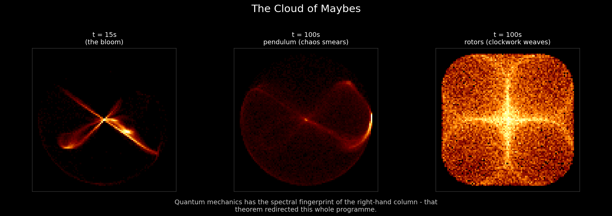
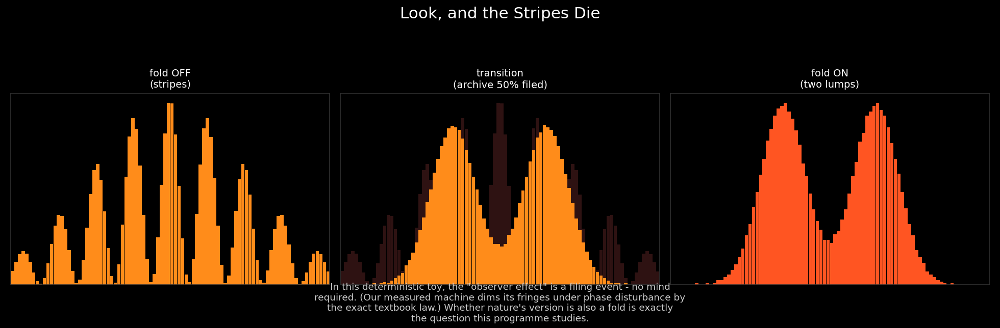

# The Universe with No Dice

*Quest for Entropy #1: is anything truly random — and how much of quantum mechanics can a machine with no dice fake?*

<!-- Substack: embed assets/hero_cloud_of_maybes.mp4 natively here; the PNG is the fallback frame -->

Einstein's complaint about quantum mechanics is the most famous sentence in physics: God does not play dice.

Here is the thought that started my quest: **dice don't play dice either.** A tumbling die is plain classical mechanics — forces, bounces, spin. It looks random to us for two simple reasons: we don't know all the forces, and we can't compute the motion fast enough. The randomness of dice is not in the dice. It's in us.

Once you see that, you start checking everything else. The random numbers in your computer? Pseudorandom — an algorithm with a mask on. The serious entropy sources behind cryptography — lava lamps, weather, atmospheric noise? Chaotic classical physics: impossible to predict because tiny differences blow up exponentially, not because anything is undetermined. Follow this to the end and you find there is no true randomness in the classical world. Everything is a mechanism we can't afford to compute.

Except one thing, supposedly: quantum mechanics. There, the books say, the randomness is real. Intrinsic. No mechanism underneath. And maybe so. But "no mechanism underneath" is a strange thing to be sure about — if the mechanism sat one layer below what we can reach, how would we know? We might never know. Which makes it a good question for an engineer:

**Can I build a fully deterministic, classical machine — a model universe — that reproduces quantum effects?**

Not a theory of everything. Not a claim about what our universe really does. Just: does at least one such clockwork exist? Because if it does, "intrinsically random" quietly becomes "random to whoever lives inside" — and that is a different universe to live in.

## The question

Before building anything, I fixed the rules. This territory is full of ways to fool yourself.

**Rule 1 — Bell.** Bell's theorem and the experiments after it killed local hidden variables, at any level of cleverness. We tested this ourselves instead of taking it on faith: five pseudorandom hidden-variable schemes, from trivial to cryptographic, all stuck exactly at the classical limit. So if there is hidden machinery, it must be *global*.

**Rule 2 — causality, and the iceberg.** The speed of light limits information in the visible world, and entanglement seems to laugh at that limit. My answer is what I call the **iceberg model**: the hidden layer is the submerged bulk, and the visible universe — space, time, matter, the speed limit itself — is the tip that grows out of it. Correlations can live in the shared hidden state without any signal crossing visible space. But the hidden layer is not lawless: order of events and causality must be preserved everywhere. (We later tested this with two observers inside the machine: in every test, tampering on one side never showed up in the other observer's records before light could have arrived. The iceberg keeps relativity's promises at the surface.)

**Rule 3 — nothing is ever destroyed.** The hidden layer must be reversible: run it backward and every state comes back. In the machine we built, this is verified to one part in a quadrillion per round trip.

**Rule 4 — count, don't compute.** Every probability must be **counted from events, never computed from a quantum formula.** The formulas appear only as reference curves at the end, to compare against. We learned the hard way that this rule matters: statistics that "look quantum" at a single moment come free with almost any data stream, and prove nothing.

And one idea sits under all of it. If classical randomness is really complexity seen by someone who can't compute it, then quantum randomness needs an audience too. The central character of this whole series is the **bounded observer**: an observer with limited memory and limited compute, living inside something bigger than itself. To such an observer, a rich enough mechanism doesn't look mechanical. It looks random.

## The toy

So what should the mechanism be? My gut said: something with waves or oscillation in it. I started trying known machines, and the failures drew the map.

**The double pendulum came first** — it's the hero image above, the one I call the cloud of maybes. Take thousands of copies of a chaotic double pendulum, started almost identically, and their positions smear into a glowing cloud that looks a lot like a probability wave, or an electron cloud. It's beautiful. It's also a dead end: it looks the part, but the mechanism is too poor to carry real quantum structure.

**Chaos and lattices came next.** Coupled chaotic maps gave real wave propagation across space, and promising interference — but not the Born rule: the counted probabilities refused to follow the squared law. Later we understood why, and it became a signpost: chaotic mixing destroys the delicate frequency structure quantum behavior needs. Chaos was the wrong kind of complexity all along. Look at the hero image again: the middle panel is the pendulum's smear, the right panel is what we actually needed — a clockwork weave, structured, not chaotic. Quantum mechanics has the fingerprint of the weave.

**Other tries failed in their own ways.** Exact digital machines: a finite clock can't hit irrational frequencies, and the weave runs on them — notes that never repeat. Generic hidden-variable schemes: they produce a tell-tale disease we learned to spot instantly — square stripes and perfect, exact-zero interference dips, where real quantum dips are shaped and soft.

**One more thing had to go: the outside observer.** For a long time we measured our worlds the obvious way — point a camera at them and count. It kept failing, and for what turned out to be a deep reason: a passive watcher of a deterministic world sees statistics that stay inside the classical bounds, while quantum measurement breaks them. We checked this from enough angles that we now treat it as a cornerstone of the project. What the quantum formalism seems to describe is an observer whose measurement *changes what it can access*. A camera can't fake that. The observer must be part of the system — it must touch.

**The machine that finally worked** puts the lessons together. The hidden layer: a small clockwork of rotating phases at incommensurate frequencies — the weave, not the smear. Inside it: a bounded observer. When it measures, something physical happens — its current state is filed into a one-way archive it can never read again, and it gets re-prepared from the world's own clockwork, with a specific lopsided recipe (found by an optimizer; I say so openly — this is engineering) leaning about 2.5-to-1 toward what was just measured. No collapse rule. No randomness rule. Bookkeeping, and a one-way door.

## The run

Point the machine at the famous experiments and count.

**Born statistics:** the observer's counted frequencies land within about one percent of the quantum squared law — across two substrate worlds and more than nine measurement setups. The controls make that number mean something: the same clockwork *without* the measurement interaction counts plainly classical (off by 40 to 95 percent); flatten the lopsided recipe and it fails; keep the right numbers in the wrong shape and it fails even harder — every time.

<!-- Substack: embed assets/stripes_die.mp4 natively -->

**The double-slit:** the same frozen machine draws cosine stripes on the quantum curves (shape error 1.5 to 4.7 percent), with *soft* dips at the right depths — while every generic control shows the exact-zero disease. Blur the phases on purpose and the stripes dim by the exact textbook decoherence law. And the panel above is the part everyone asks about: keep path information out of the observer's archive and you get stripes; let it land in the archive and the stripes die into two lumps. In this model universe, the "observer effect" is a filing event. No consciousness required.

One machine, counted, no dice: the squared law, the stripes, the soft dips, the fading.

## The Confession

Now the part that makes this science and not a magic show.

**My model universe misses real quantum mechanics by a measured, structured amount — about one percent — and it cannot do better in a specific, checkable way.** The counted statistics equal the quantum prediction plus a small deterministic leftover that we measured, dissected, and in a reduced setting derived exactly. Its sharpest consequence: this machine cannot cancel interference deeper than roughly one part in a hundred. Real quantum mechanics goes arbitrarily deep — and real laboratory interferometers routinely do. So at the parameters we tested, this construction is very likely already ruled out as a literal model of our world, by experiments that existed before I built it.

I think that is the best feature of the whole project. A model that explains everything and forbids nothing is mysticism with extra steps. This one forbids something: worlds built this way have an interference floor. An experiment can kill that statement — and whether the floor shrinks as the machine's coupling gets weaker is genuinely open. My model universe fails exactly where yours succeeds. You can check.

## What this does NOT claim

> This post is a **demonstration**, not a discovery about nature. It does not claim our universe is deterministic, does not reinterpret quantum mechanics, and does not evade Bell's theorem — the hidden machinery is *global*, not local, exactly because Bell forbids the local kind (we checked). The observer's recipe was found by an optimizer aimed at the quantum statistics, and I call that what it is: engineering. The claim is that this behavior is *achievable* from determinism plus physical measurement — not that this is *why* our world is quantum. And the one-percent match is scoped: one construction family, tested settings, with its deviation published as a falsifiable limit instead of hidden in error bars.

## The neighbors

This corner of idea-space has serious residents. Full honesty about how this map was drawn: the literature checking and cross-referencing was done mainly by AI — I guided the direction, asked the questions, and supplied the crazy ideas; the AI did the reading. Here is the map it drew, which I stand behind. Gerard 't Hooft has long argued that quantum mechanics could sit on top of a deterministic substrate — his [Cellular Automaton Interpretation](https://arxiv.org/abs/1405.1548) is the closest neighbor in spirit, though his substrate stays local and meets Bell's theorem by a different route than our global iceberg; the difference here is method: instead of arguing an interpretation, we built a small machine and counted, and the counting produced a falsifiable deviation rather than a claimed equivalence. [Bohmian mechanics](https://plato.stanford.edu/entries/qm-bohm/) showed back in 1952 that deterministic-but-nonlocal versions of quantum mechanics exist; the difference is cost — Bohm keeps the whole wavefunction as hidden machinery, while this project asks how much *cheaper* the hidden layer can get before quantum behavior degrades (so far: within one percent, and the last percent fights back). [Stephen Wolfram's programme](https://www.wolframphysics.org/) shares the computational-universe instinct at a much grander scale; this is the opposite bet in size — one small claim, fully counted, failure published. And Wojciech Zurek's [decoherence programme](https://arxiv.org/abs/quant-ph/0105127) is the orthodox mirror of our one-way archive; our machine reproduces its coherence-loss law by counting alone.

## Run it yourself

Poke the machines yourself, right in the browser, no install: **[the cloud of maybes](https://quest-for-entropy.web.app/cloud-of-maybes)** and **[look, and the stripes die](https://quest-for-entropy.web.app/stripes-die)**. Both are pure client-side pages — every dot on your screen is computed live from the same deterministic rules described above.

Everything counted in this post reproduces from a companion repository with one command: **[github.com/masteris777/quest-for-entropy-the-universe-with-no-dice](https://github.com/masteris777/quest-for-entropy-the-universe-with-no-dice)** — `python run_all.py` regenerates the counts, the stripes, and every figure. Archived, citable snapshot: DOI to-be-minted-at-publication (Zenodo).

## How this was made

I'm a software architect. Physics and the deep math here are not my profession — they're what I'm curious about, and in my spare time I use AI to explore them and learn. The honest division of labor: the heavy lifting — the math, the physics checks, the code, the computations — was done by AI, with me setting the direction, asking the questions, and making the calls. Main models: Anthropic Fable 5 and Sonnet 5, with support from OpenAI GPT 5.6 Sol, DeepSeek v4 Pro, and Google Gemini 3.1. To keep us honest, the work runs through a harness I built: experiments follow rules fixed in advance, results get challenged by independent AI review, and every mistake we catch goes into an honesty ledger — which will go public as the series continues. Every number in this post comes from code you can run, not from a model's memory.

## Next time

The machine above pays for its quantum disguise in a strange currency — and following that currency leads somewhere unexpected: a universe that has to *grow*. That's episode two.

---

*Quest for Entropy is written by Marijus Masteika. Entropy was always the dark horse for me — connected to information, and maybe hiding answers to everything. That's the quest.*
